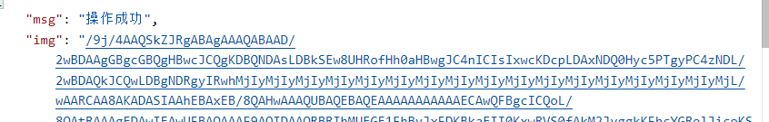
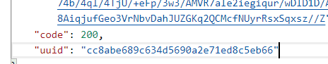
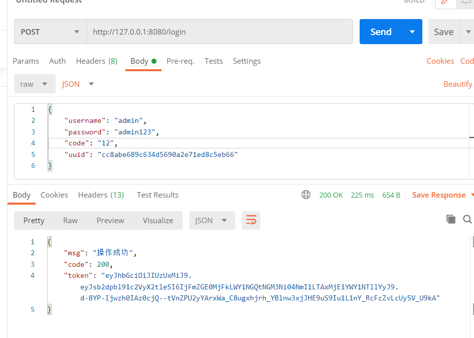

# RuoYi源码阅读记录

+ 应用的配置文件位于ruoyi-admin模块的application.yml当中
+ 对于全局抛出的异常处理，位于ruoyi-framework模块的GlobalExceptionHandler类中

## 系统自带登录接口的登录流程
+ 登录接口通过SysLoginController实现（实现于RuoYi-admin模块中）
+ 鉴权方式为JWT鉴权 实现于JwtAuthenticationTokenFilter（在ruoyi-framework模块中）
+ JWT应存储于请求头的Authorization字段当中，格式为"Bearer " + token
+ 数据库中存储的密码是经过加密的，加密在ruoyi-common模块中的SecurityUtils类的encryptPassword()方法实现

登录的逻辑流程如下：
1. 以GET方法请求/captchaImage接口，获取验证码图片（base64格式，存储于img字段当中）以及验证码的唯一标识符（字符串，存储于uuid字段中）
 
 
2. 之后以POST方法请求/login接口，提交用户名、密码、验证码和uuid，获取返回值中的code字段判断是否登陆成功
 
注：RuoYi自带的接口，在访问时无论是否成功，状态码均为200 
如果需要判断操作是否成功，必须从返回体（body）当中的code字段进行判断 
如果登录成功，会额外返回一个token字段，存储后续用于进行接口鉴权的JWT 
