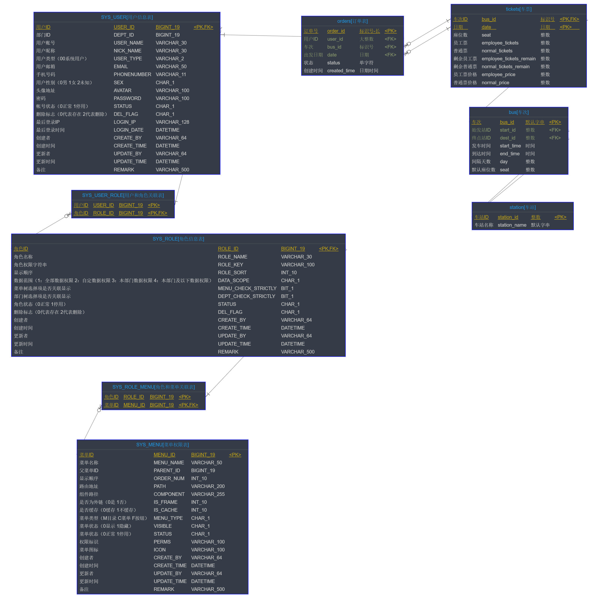

## 
目录

 - ### 1. 模块清单
- [<h4 id="module-DB_REVERSE_MYSQL-from">1.1. 逆向解析\_MYSQL</h4>](#module-DB_REVERSE_MYSQL "DB_REVERSE_MYSQL")
	- [<h5 id="module-DB_REVERSE_MYSQL-relation}-from">1.1.1. 关联关系</h5>](#module-DB_REVERSE_MYSQL-relation "关联关系")
	- [<h5 id="module-DB_REVERSE_MYSQL-tableList-from">1.1.2. 表清单</h5>](#module-DB_REVERSE_MYSQL-tableList "表清单")
	- [<h5 id="module-DB_REVERSE_MYSQL-tableColumnList-from">1.1.3. 表列清单</h5>](#module-DB_REVERSE_MYSQL-tableColumnList "表列清单")
		- [<h6 id="module-DB_REVERSE_MYSQL-tableColumnList-SYS_USER-from">1.1.3.1 SYS\_USER【用户信息表】</h6>](#module-DB_REVERSE_MYSQL-tableColumnList-SYS_USER "SYS_USER")
		- [<h6 id="module-DB_REVERSE_MYSQL-tableColumnList-SYS_USER_ROLE-from">1.1.3.2 SYS\_USER\_ROLE【用户和角色关联表】</h6>](#module-DB_REVERSE_MYSQL-tableColumnList-SYS_USER_ROLE "SYS_USER_ROLE")
		- [<h6 id="module-DB_REVERSE_MYSQL-tableColumnList-SYS_MENU-from">1.1.3.3 SYS\_MENU【菜单权限表】</h6>](#module-DB_REVERSE_MYSQL-tableColumnList-SYS_MENU "SYS_MENU")
		- [<h6 id="module-DB_REVERSE_MYSQL-tableColumnList-SYS_ROLE-from">1.1.3.4 SYS\_ROLE【角色信息表】</h6>](#module-DB_REVERSE_MYSQL-tableColumnList-SYS_ROLE "SYS_ROLE")
		- [<h6 id="module-DB_REVERSE_MYSQL-tableColumnList-SYS_ROLE_MENU-from">1.1.3.5 SYS\_ROLE\_MENU【角色和菜单关联表】</h6>](#module-DB_REVERSE_MYSQL-tableColumnList-SYS_ROLE_MENU "SYS_ROLE_MENU")
		- [<h6 id="module-DB_REVERSE_MYSQL-tableColumnList-orders-from">1.1.3.6 orders【订单表】</h6>](#module-DB_REVERSE_MYSQL-tableColumnList-orders "orders")
		- [<h6 id="module-DB_REVERSE_MYSQL-tableColumnList-tickets-from">1.1.3.7 tickets【车票】</h6>](#module-DB_REVERSE_MYSQL-tableColumnList-tickets "tickets")
		- [<h6 id="module-DB_REVERSE_MYSQL-tableColumnList-bus-from">1.1.3.8 bus【车次】</h6>](#module-DB_REVERSE_MYSQL-tableColumnList-bus "bus")
		- [<h6 id="module-DB_REVERSE_MYSQL-tableColumnList-station-from">1.1.3.9 station【车站】</h6>](#module-DB_REVERSE_MYSQL-tableColumnList-station "station")
  ---

### 1. 模块清单
 - [<h4 id="module-DB_REVERSE_MYSQL">1.1. 逆向解析_MYSQL</h4>](#module-DB_REVERSE_MYSQL-from)
 - [<h5 id="module-DB_REVERSE_MYSQL-relation">1.1.1 关联关系</h5>](#module-DB_REVERSE_MYSQL-relation-from)
 ---

 ---

 - [<h5 id="module-DB_REVERSE_MYSQL-tableList">1.1.2 表清单</h5>](#module-DB_REVERSE_MYSQL-tableList-from)

 ---

| 名称 | 代码 | 备注 |
| ------------ | ------------ | ------------ |
| 用户信息表 | SYS\_USER |  |
| 用户和角色关联表 | SYS\_USER\_ROLE |  |
| 菜单权限表 | SYS\_MENU |  |
| 角色信息表 | SYS\_ROLE |  |
| 角色和菜单关联表 | SYS\_ROLE\_MENU |  |
| 订单表 | orders | 订单表 |
| 车票 | tickets |  |
| 车次 | bus |  |
| 车站 | station |  |

 ---

 - [<h5 id="module-DB_REVERSE_MYSQL-tableColumnList">1.1.3 表列清单</h5>](#module-DB_REVERSE_MYSQL-tableColumnList-from)

 ---

 - [<h6 id="module-DB_REVERSE_MYSQL-tableColumnList-SYS_USER">SYS_USER【用户信息表】</h6>](#module-DB_REVERSE_MYSQL-tableColumnList-SYS_USER-from)

| 代码 | 名称 | 数据类型(MYSQL) | 主键 | 备注 |
| ------------ | ------------ | ------------ | ------------ | ------------ |
| USER\_ID | 用户ID | BIGINT(19) | √ |  |
| DEPT\_ID | 部门ID | BIGINT(19) |  |  |
| USER\_NAME | 用户账号 | VARCHAR(30) |  |  |
| NICK\_NAME | 用户昵称 | VARCHAR(30) |  |  |
| USER\_TYPE | 用户类型（00系统用户） | VARCHAR(2) |  |  |
| EMAIL | 用户邮箱 | VARCHAR(50) |  |  |
| PHONENUMBER | 手机号码 | VARCHAR(11) |  |  |
| SEX | 用户性别（0男 1女 2未知） | CHAR(1) |  |  |
| AVATAR | 头像地址 | VARCHAR(100) |  |  |
| PASSWORD | 密码 | VARCHAR(100) |  |  |
| STATUS | 帐号状态（0正常 1停用） | CHAR(1) |  |  |
| DEL\_FLAG | 删除标志（0代表存在 2代表删除） | CHAR(1) |  |  |
| LOGIN\_IP | 最后登录IP | VARCHAR(128) |  |  |
| LOGIN\_DATE | 最后登录时间 | DATETIME |  |  |
| CREATE\_BY | 创建者 | VARCHAR(64) |  |  |
| CREATE\_TIME | 创建时间 | DATETIME |  |  |
| UPDATE\_BY | 更新者 | VARCHAR(64) |  |  |
| UPDATE\_TIME | 更新时间 | DATETIME |  |  |
| REMARK | 备注 | VARCHAR(500) |  |  |

 ---

 - [<h6 id="module-DB_REVERSE_MYSQL-tableColumnList-SYS_USER_ROLE">SYS_USER_ROLE【用户和角色关联表】</h6>](#module-DB_REVERSE_MYSQL-tableColumnList-SYS_USER_ROLE-from)

| 代码 | 名称 | 数据类型(MYSQL) | 主键 | 备注 |
| ------------ | ------------ | ------------ | ------------ | ------------ |
| USER\_ID | 用户ID | BIGINT(19) | √ |  |
| ROLE\_ID | 角色ID | BIGINT(19) | √ |  |

 ---

 - [<h6 id="module-DB_REVERSE_MYSQL-tableColumnList-SYS_MENU">SYS_MENU【菜单权限表】</h6>](#module-DB_REVERSE_MYSQL-tableColumnList-SYS_MENU-from)

| 代码 | 名称 | 数据类型(MYSQL) | 主键 | 备注 |
| ------------ | ------------ | ------------ | ------------ | ------------ |
| MENU\_ID | 菜单ID | BIGINT(19) | √ |  |
| MENU\_NAME | 菜单名称 | VARCHAR(50) |  |  |
| PARENT\_ID | 父菜单ID | BIGINT(19) |  |  |
| ORDER\_NUM | 显示顺序 | INT(10) |  |  |
| PATH | 路由地址 | VARCHAR(200) |  |  |
| COMPONENT | 组件路径 | VARCHAR(255) |  |  |
| IS\_FRAME | 是否为外链（0是 1否） | INT(10) |  |  |
| IS\_CACHE | 是否缓存（0缓存 1不缓存） | INT(10) |  |  |
| MENU\_TYPE | 菜单类型（M目录 C菜单 F按钮） | CHAR(1) |  |  |
| VISIBLE | 菜单状态（0显示 1隐藏） | CHAR(1) |  |  |
| STATUS | 菜单状态（0正常 1停用） | CHAR(1) |  |  |
| PERMS | 权限标识 | VARCHAR(100) |  |  |
| ICON | 菜单图标 | VARCHAR(100) |  |  |
| CREATE\_BY | 创建者 | VARCHAR(64) |  |  |
| CREATE\_TIME | 创建时间 | DATETIME |  |  |
| UPDATE\_BY | 更新者 | VARCHAR(64) |  |  |
| UPDATE\_TIME | 更新时间 | DATETIME |  |  |
| REMARK | 备注 | VARCHAR(500) |  |  |

 ---

 - [<h6 id="module-DB_REVERSE_MYSQL-tableColumnList-SYS_ROLE">SYS_ROLE【角色信息表】</h6>](#module-DB_REVERSE_MYSQL-tableColumnList-SYS_ROLE-from)

| 代码 | 名称 | 数据类型(MYSQL) | 主键 | 备注 |
| ------------ | ------------ | ------------ | ------------ | ------------ |
| ROLE\_ID | 角色ID | BIGINT(19) | √ |  |
| ROLE\_NAME | 角色名称 | VARCHAR(30) |  |  |
| ROLE\_KEY | 角色权限字符串 | VARCHAR(100) |  |  |
| ROLE\_SORT | 显示顺序 | INT(10) |  |  |
| DATA\_SCOPE | 数据范围（1：全部数据权限 2：自定数据权限 3：本部门数据权限 4：本部门及以下数据权限） | CHAR(1) |  |  |
| MENU\_CHECK\_STRICTLY | 菜单树选择项是否关联显示 | BIT(1) |  |  |
| DEPT\_CHECK\_STRICTLY | 部门树选择项是否关联显示 | BIT(1) |  |  |
| STATUS | 角色状态（0正常 1停用） | CHAR(1) |  |  |
| DEL\_FLAG | 删除标志（0代表存在 2代表删除） | CHAR(1) |  |  |
| CREATE\_BY | 创建者 | VARCHAR(64) |  |  |
| CREATE\_TIME | 创建时间 | DATETIME |  |  |
| UPDATE\_BY | 更新者 | VARCHAR(64) |  |  |
| UPDATE\_TIME | 更新时间 | DATETIME |  |  |
| REMARK | 备注 | VARCHAR(500) |  |  |

 ---

 - [<h6 id="module-DB_REVERSE_MYSQL-tableColumnList-SYS_ROLE_MENU">SYS_ROLE_MENU【角色和菜单关联表】</h6>](#module-DB_REVERSE_MYSQL-tableColumnList-SYS_ROLE_MENU-from)

| 代码 | 名称 | 数据类型(MYSQL) | 主键 | 备注 |
| ------------ | ------------ | ------------ | ------------ | ------------ |
| ROLE\_ID | 角色ID | BIGINT(19) | √ |  |
| MENU\_ID | 菜单ID | BIGINT(19) | √ |  |

 ---

 - [<h6 id="module-DB_REVERSE_MYSQL-tableColumnList-orders">orders【订单表】</h6>](#module-DB_REVERSE_MYSQL-tableColumnList-orders-from)

| 代码 | 名称 | 数据类型(MYSQL) | 主键 | 备注 |
| ------------ | ------------ | ------------ | ------------ | ------------ |
| order\_id | 订单号 | VARCHAR(64) | √ |  |
| user\_id | 用户ID | BIGINT |  |  |
| bus\_id | 车次 | VARCHAR(32) |  |  |
| date | 出发日期 | DATE |  |  |
| status | 状态 | CHAR(1) |  | 0表示未支付，1表示待核销，2表示已完成，3表示已关闭 |
| created\_time | 创建时间 | DATETIME |  |  |

 ---

 - [<h6 id="module-DB_REVERSE_MYSQL-tableColumnList-tickets">tickets【车票】</h6>](#module-DB_REVERSE_MYSQL-tableColumnList-tickets-from)

| 代码 | 名称 | 数据类型(MYSQL) | 主键 | 备注 |
| ------------ | ------------ | ------------ | ------------ | ------------ |
| bus\_id | 车次ID | VARCHAR(32) | √ |  |
| date | 日期 | DATE | √ |  |
| seat | 座位数 | INT |  |  |
| employee\_tickets | 员工票 | INT |  |  |
| normal\_tickets | 普通票 | INT |  |  |
| employee\_tickets\_remain | 剩余员工票 | INT |  |  |
| normal\_tickets\_remain | 剩余普通票 | INT |  |  |
| employee\_price | 员工票价格 | INT |  |  |
| normal\_price | 普通票价格 | INT |  |  |

 ---

 - [<h6 id="module-DB_REVERSE_MYSQL-tableColumnList-bus">bus【车次】</h6>](#module-DB_REVERSE_MYSQL-tableColumnList-bus-from)

| 代码 | 名称 | 数据类型(MYSQL) | 主键 | 备注 |
| ------------ | ------------ | ------------ | ------------ | ------------ |
| bus\_id | 车次 | VARCHAR(32) | √ |  |
| start\_id | 始发站ID | INT |  |  |
| dest\_id | 终点站ID | INT |  |  |
| start\_time | 发车时间 | TIME |  |  |
| end\_time | 到达时间 | TIME |  |  |
| day | 间隔天数 | INT |  |  |
| seat | 默认座位数 | INT |  |  |

 ---

 - [<h6 id="module-DB_REVERSE_MYSQL-tableColumnList-station">station【车站】</h6>](#module-DB_REVERSE_MYSQL-tableColumnList-station-from)

| 代码 | 名称 | 数据类型(MYSQL) | 主键 | 备注 |
| ------------ | ------------ | ------------ | ------------ | ------------ |
| station\_id | 车站ID | INT | √ |  |
| station\_name | 车站名称 | VARCHAR(32) |  |  |

 ---

